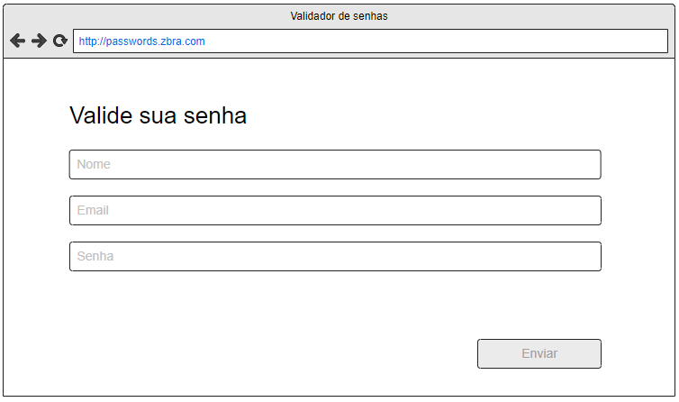

# Valide sua senha

This project was generated with [Angular CLI](https://github.com/angular/angular-cli) version 15.2.5.

## Project design
### Desktop

### Mobile

## Fisrt steps

Download the project in your computer, open the project folder in your best IDE, then run `npm install` to install all dependencies, then follow to Development server step.

## Development server

Run `npm start` for a dev server. Navigate to `http://localhost:4200/`. The application will automatically reload if you change any of the source files.

## Build

Run `npm run build` to build the project. The build artifacts will be stored in the `dist/` directory.

## Running unit tests

There are two commands to run the tests, the first one is `npm run test`, use it to enter the watch mode and reload all tests when change the source files; the second command is `npm run test:coverage`, use it to generate the code coverage file and navigate through all the lines covered.

## Running end-to-end tests

Currently this project has no e2e tests

## Further help

send me an [email](mailto:arthurpbarata@gmail.com) at `arthurpbarata@gmail.com`
